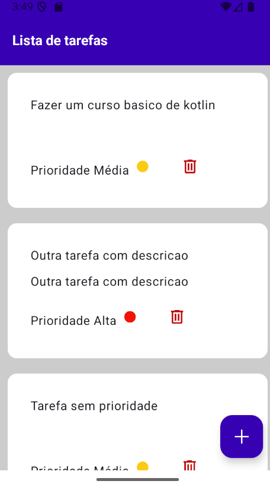
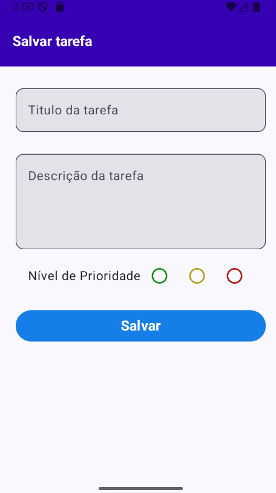
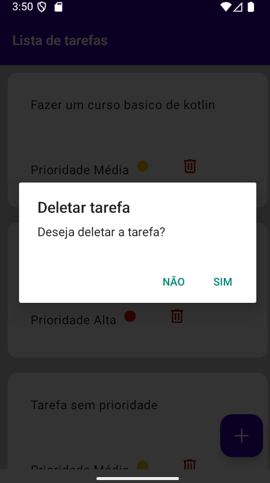

# Aplicativo de tarefas android com koltin e jetpack

## Funcionalidades
- Adicionar tarefas
- Remover tarefas
- Listar tarefas

## Tecnologias
- Kotlin
- Jetpack Compose
- Android

## Como usar
- Clone o repositório
- Abra o projeto no Android Studio
- Execute o projeto

## Fotos

|  |  |  |
|:---:|:---:|:---:|
| *Aplicação principal* | *Lista de tarefas* | *Adicionando tarefa* |

  
  
  

<!-- Para dispositivos móveis -->

  
  
  

